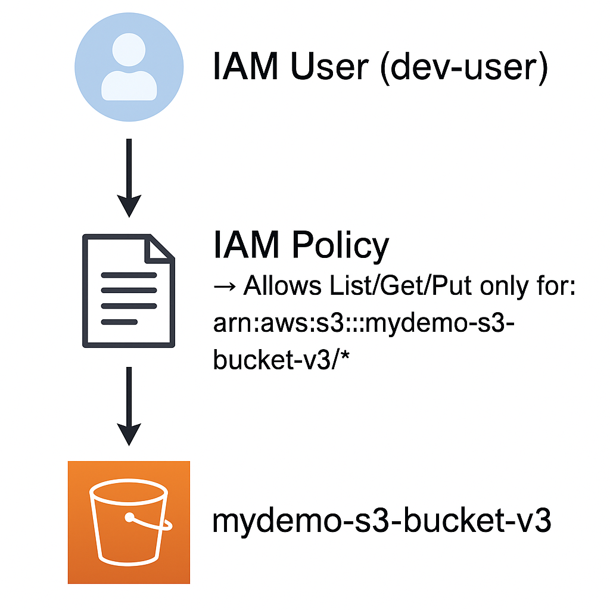
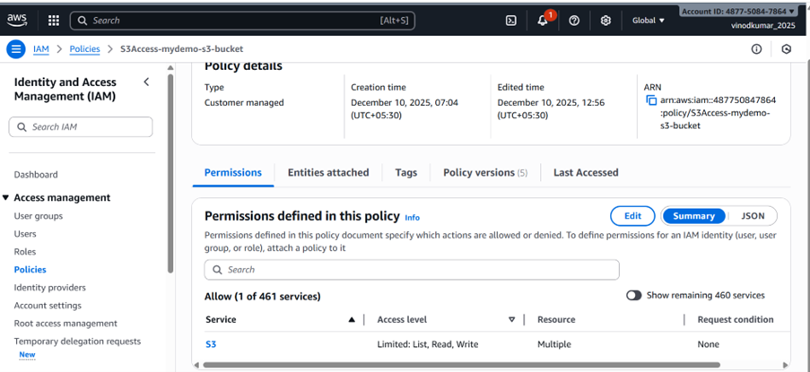
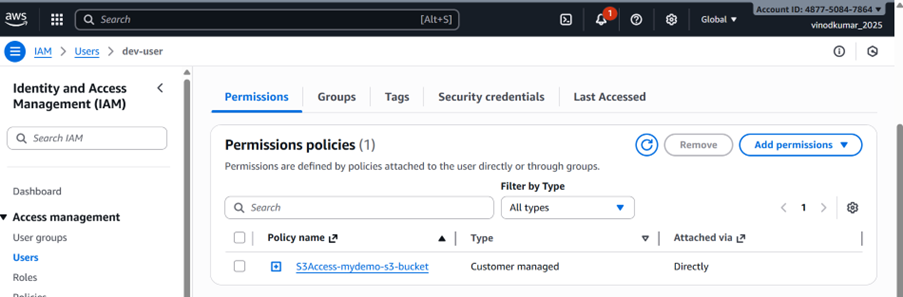
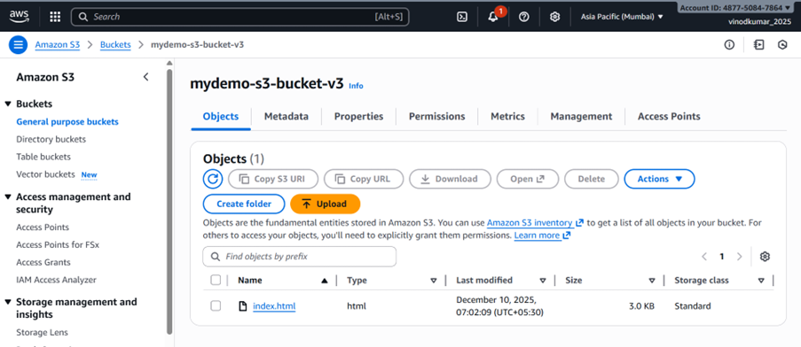
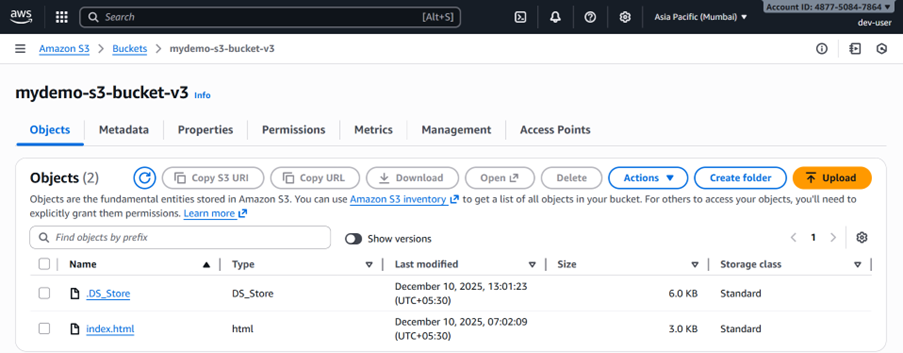
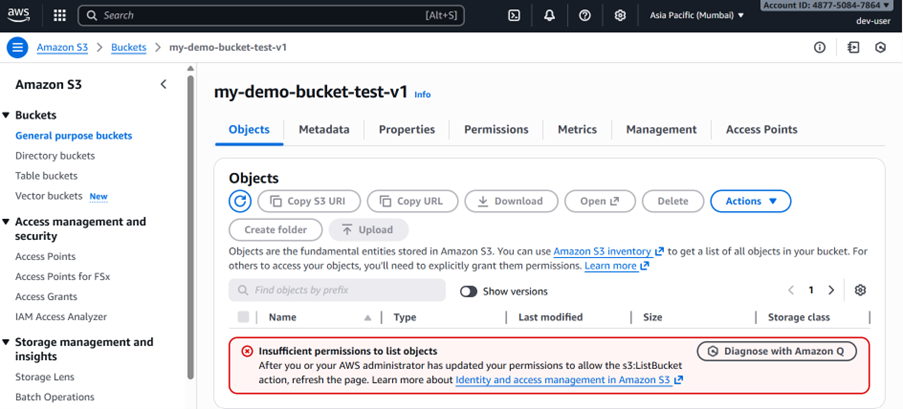

# Lab 1 – Give Developer Access Only to One S3 Bucket

This lab demonstrates how to use AWS Identity and Access Management (IAM) to grant a developer **restricted access** to a **single S3 bucket** named **`mydemo-s3-bucket-v3`**.

---
## Scenario: Developer Needs Access Only to One S3 Bucket
----
##Problem:

A developer needs read/write access to only one S3 bucket (mydemo-s3-bucket-v3). They should not access any other bucket.
----------
## Real-Time Solution:

- Create an IAM user (`dev-user`)
- Create and attach a custom IAM policy that gives access only to one S3 bucket
- Verify restricted access using AWS Console or AWS CLI

---

## Architecture Overview:

```
IAM User (dev-user)
      │
      ▼
IAM Policy → Allows List/Get/Put only for: arn:aws:s3:::mydemo-s3-bucket-v3/*
      │
      ▼
S3 Bucket: mydemo-s3-bucket-v3

```

---

## Custom IAM Policy (Single Bucket Access):

Create a policy named **`S3Access-mydemo-bucket`** with the following JSON:

```json
{
	"Version": "2012-10-17",
	"Statement": [
		{
			"Effect": "Allow",
			"Action": [
				"s3:ListBucket"
			],
			"Resource": "arn:aws:s3:::mydemo-s3-bucket-v3"
		},
		{
			"Effect": "Allow",
			"Action": [
				"s3:GetObject",
				"s3:PutObject"
			],
			"Resource": "arn:aws:s3:::mydemo-s3-bucket-v3/*"
		}
	]
}

```

---

## Steps Performed:

### **1️.Create IAM User**
- Go to IAM → Users → Create User  
- Username: **`dev-user`**  
- Do not attach permissions yet.

---

### **2.Create Custom IAM Policy**
Navigate to:  
**IAM → Policies → Create Policy → JSON**

Paste the policy shown above.  
Name the policy: **`S3Access-mydemo-bucket`**

---

### **3.Attach Policy to dev-user**
- IAM → Users → `dev-user` → Permissions → Add permissions  
- Attach: **`S3Access-mydemo-bucket`**

---

## Expected Behavior:

### ✔ Allowed:
- Access to `mydemo-s3-bucket-v3` contents
- Upload objects
- Download objects
- List objects **inside** the bucket

### ❌ Not Allowed:
- Viewing S3 bucket list UI (shows **Access Denied**, expected)
- Accessing any other S3 bucket
- Creating or deleting buckets

---

## 🔗 How to Access the Bucket:

Since `s3:ListAllMyBuckets` permission is *not* granted, the S3 console cannot list all buckets.

Use one of the following methods:

### **Console URL**
```
https://ap-south-1.console.aws.amazon.com/s3/buckets/mydemo-s3-bucket-v3
```

---

## Notes:
- https://ap-south-1.console.aws.amazon.com/s3/buckets/my-demo-bucket-test-v1
- “Access Denied” on the S3 dashboard is **normal** for least-privilege IAM.
- This lab mirrors real-world IAM best practices.
- The user can only work with the allowed bucket.

---
## Screenshots:













## ✅ Lab Status: Completed

You have successfully implemented an IAM-restricted S3 access model!

---
