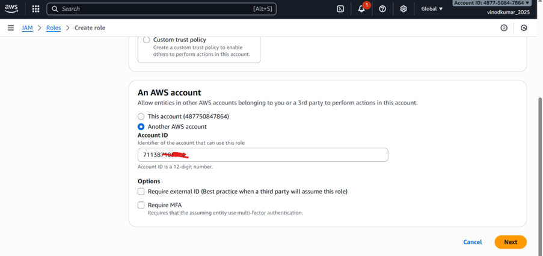
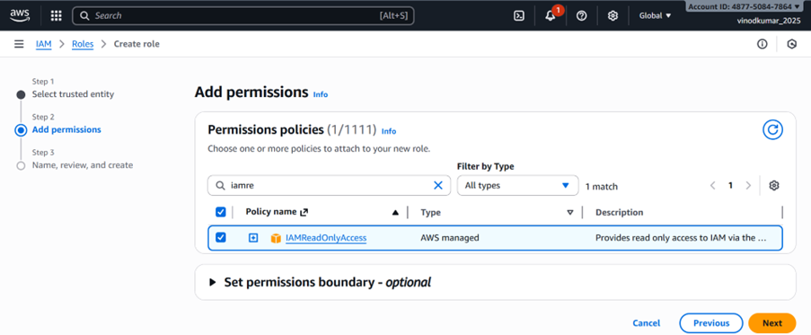
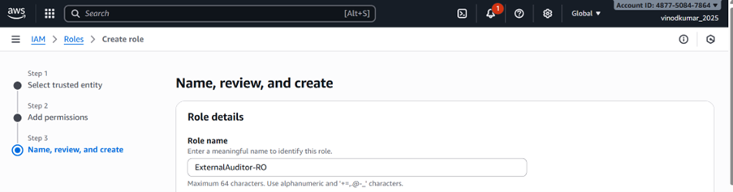
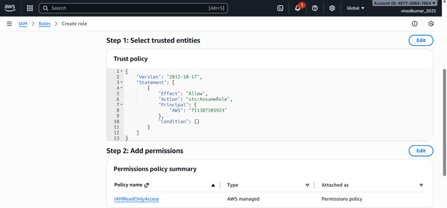
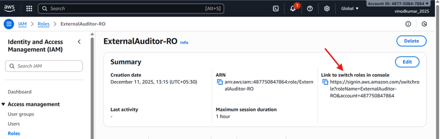
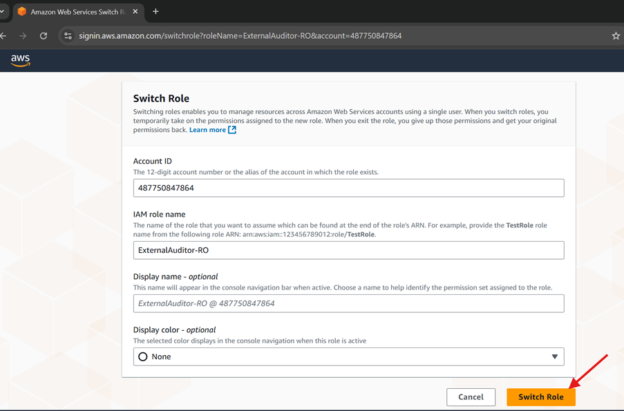
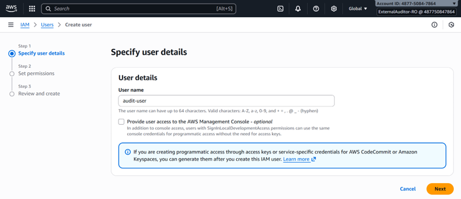
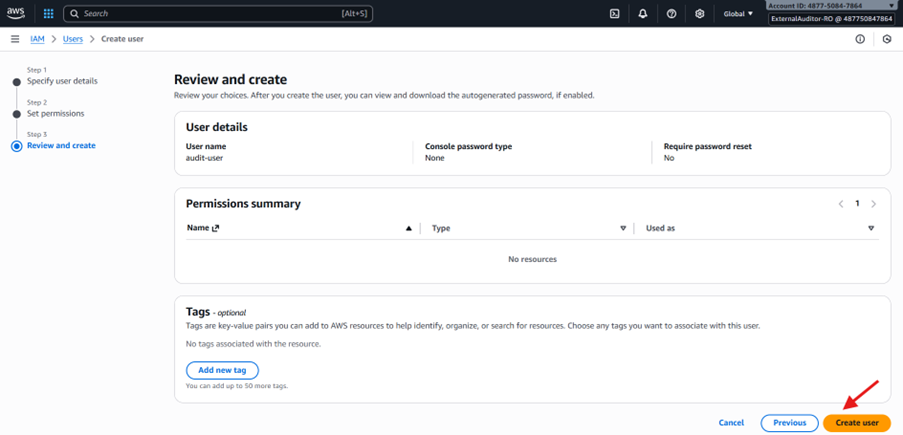
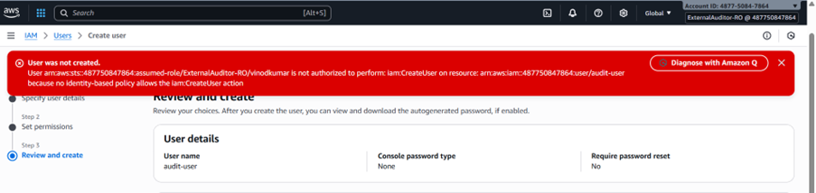

# LAB 2 — Temporary Access for External Auditor (Read-Only Access)

This lab demonstrates how to provide **temporary, secure, read-only access** to an external auditor using **AWS IAM Roles + STS AssumeRole** without sharing long-term credentials.

---

## Objective:
Provide an external auditor with **24-hour read-only access** to your AWS account by creating a dedicated IAM role that can be assumed temporarily.

---

## Use Case:
Organizations often need to give auditors temporary visibility into AWS resources.  
This must be done securely using:

- IAM Role  
- ReadOnlyAccess policy  
- STS AssumeRole  
- No IAM user creation  
- No long-term access keys  

This ensures least-privilege and zero long-term credential exposure.

---

## Steps to Implement:

### Step 1 — Create IAM Role for External Auditor
1. Open **IAM → Roles → Create role**
2. Select **Another AWS Account**
3. Enter the **auditor’s AWS Account ID**
4. Click **Next**

---

### Step 2 — Attach Read-Only Permissions
Attach the AWS-managed policy:

```
IAMReadOnlyAccess
```

---

### Step 3 — Name the Role
Suggested name:

```
ExternalAuditor-RO
```

---

##  Step 4 — Modify Trust Policy (Optional)

```json
{
  "Version": "2012-10-17",
  "Statement": [
    {
      "Effect": "Allow",
      "Principal": {
        "AWS": "arn:aws:iam::<AUDITOR_ACCOUNT_ID>:root"
      },
      "Action": "sts:AssumeRole"
    }
  ]
}
```

---

##  Step 5 — Share Role ARN with Auditor
Share:

```
arn:aws:iam::<YOUR_ACCOUNT_ID>:role/ExternalAuditor-RO
```

---

## Auditor CLI Assume-Role Example

```sh
aws sts assume-role   --role-arn arn:aws:iam::<YOUR_ACCOUNT_ID>:role/ExternalAuditor-RO   --role-session-name AuditSession
```

---

##  Verification

### Auditor CAN:
- View EC2, S3, RDS, VPC, IAM (read-only)

### Auditor CANNOT:
- Modify or delete resources
- Change IAM
- Delete S3 objects

---

## Files in This Lab Folder:
```
images
README.md
trust-policy.json
```

---

## Conclusion:
This lab reinforces secure IAM practices by granting temporary least-privilege access without exposing long-term keys.

---

## Screenshots:

























