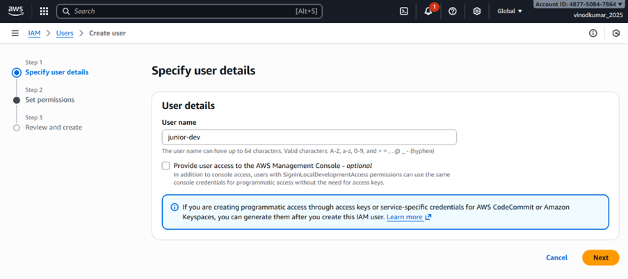
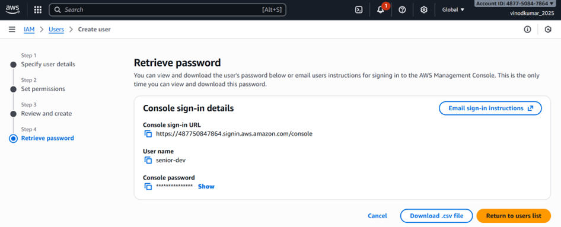
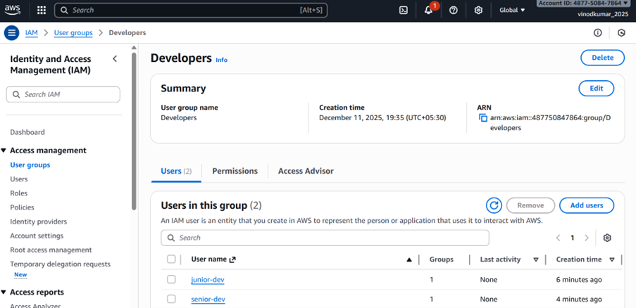
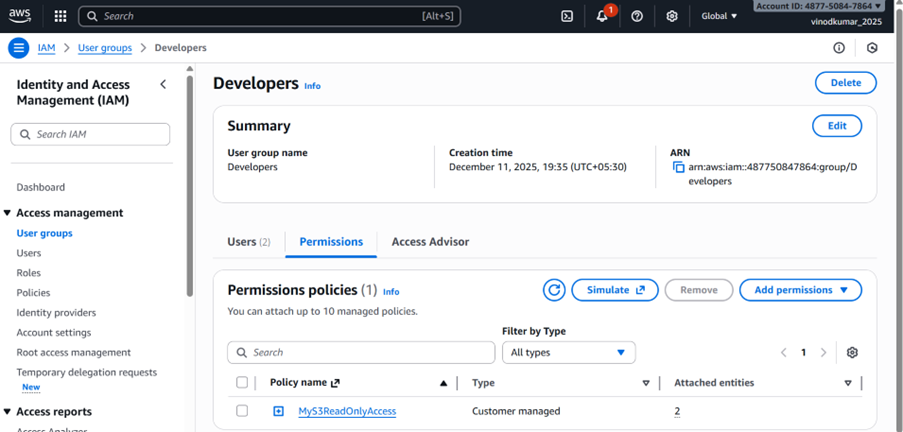
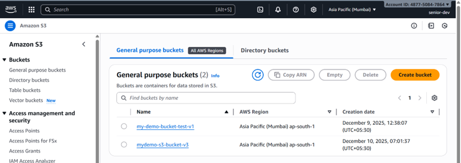
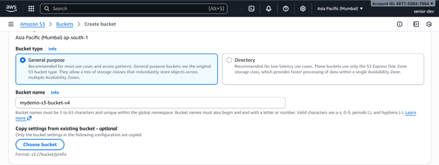
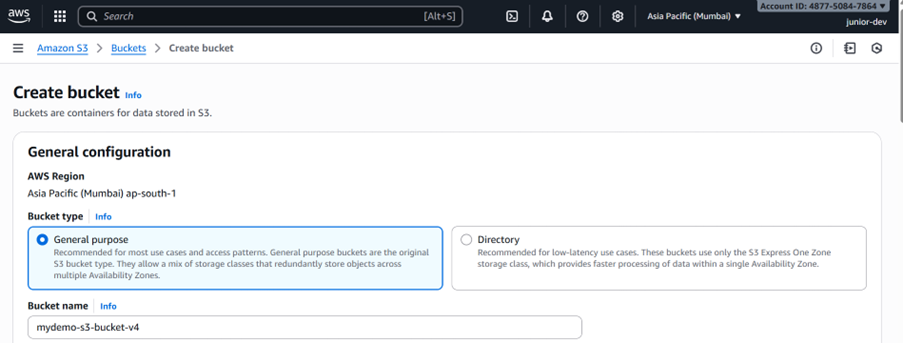
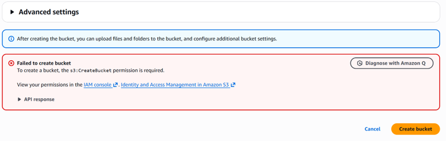

# LAB 3 — Add New Developer with Same Access as Existing Developer

## Objective:
Create a new IAM user and grant them the same permissions as an existing developer by assigning them to the same IAM groups.

---

## Step 1: Identify Existing Developer's Groups:

1. Go to **IAM → Users**.
2. Click the existing user (e.g., `senior-dev`).
3. Open the **Permissions** tab.
4. Note the groups assigned (e.g., `Developers`, `S3-Editors`).

### AWS CLI
```bash
aws iam list-groups-for-user --user-name senior-dev
```

---

## Step 2: Create the New IAM User:

### Console
1. IAM → Users → **Create user**.
2. Username: `junior-dev`.
3. Select:
   - **Console access** (if needed)
   - **Programmatic access** (if CLI/API is needed)
4. Click **Create user**.

### CLI
```bash
aws iam create-user --user-name junior-dev
aws iam create-login-profile --user-name junior-dev --password 'TemporaryPassw0rd!' --password-reset-required
```

---

## Step 3: Add New User to the Same Groups

### Console
1. IAM → Groups → open each group used by `senior-dev`.
2. Click **Add users** → select `junior-dev`.

### CLI
```bash
aws iam add-user-to-group --user-name junior-dev --group-name Developers
aws iam add-user-to-group --user-name junior-dev --group-name S3-Editors
```

---

## Step 4: Verify Permissions

### Console
- IAM → Users → `junior-dev` → **Permissions** tab.
- Confirm all group-based permissions appear.
---
## Policy Used:

{
    "Version": "2012-10-17",
    "Statement": [
        {
            "Effect": "Allow",
            "Action": [
                "s3:ListAllMyBuckets",
                "s3:GetBucketLocation"
            ],
            "Resource": "*"
        }
    ]
}

---
### Policy Simulator
Use IAM Policy Simulator to test actions.

### CLI
```bash
aws iam list-groups-for-user --user-name junior-dev
aws sts get-caller-identity
```

---

## Best Practices
- Always use **IAM groups** (role-based access).
- Avoid assigning permissions directly to users.
- Convert user inline policies → group-managed policies.
- Enforce MFA.
- Follow least privilege.

---

## Completion
The new developer now has identical permissions as the existing developer.

---

## Screenshots:























