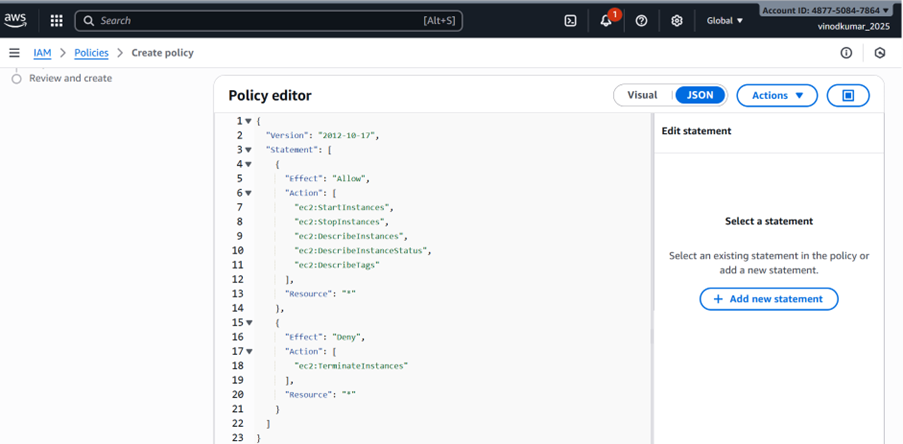
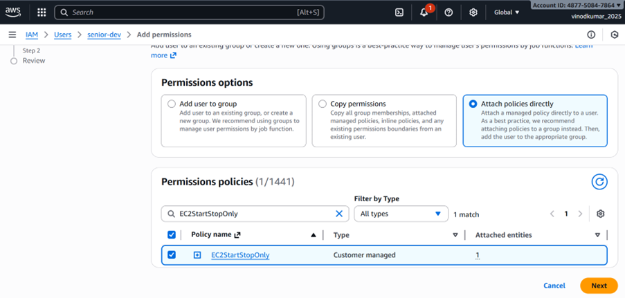
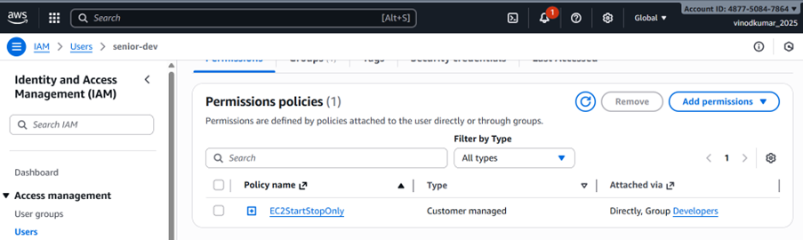
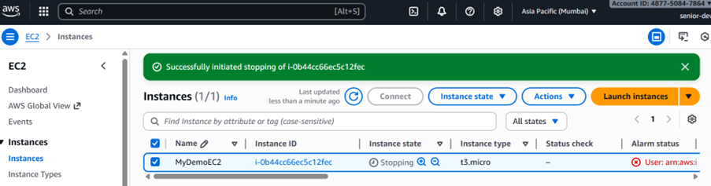
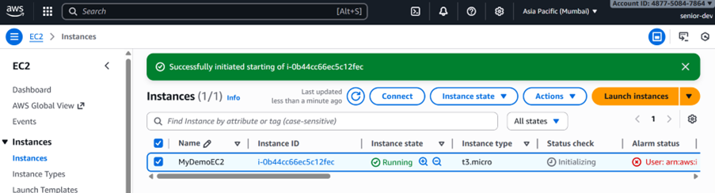
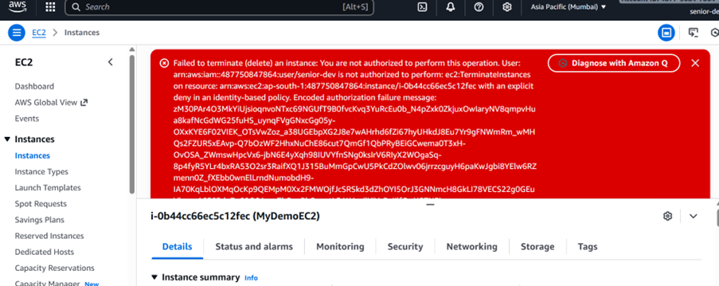

# LAB 4 — Allow Start/Stop EC2 Instances Only

## Objective:
Create an IAM user who can:
- ✔ Start EC2 instances  
- ✔ Stop EC2 instances  
- ✔ View EC2 information  

But **cannot**:
- ✘ Terminate EC2 instances  
- ✘ Launch new EC2 instances  
- ✘ Modify networking, AMIs, volumes, or security groups  

---

##  Step 1 — Create IAM User / use existing user 

1. Open **IAM Console → Users → Create user**  
2. Username: `ec2-operator`  
3. Choose access:
   - Console access (optional)
   - Programmatic access (CLI)  
4. Do NOT attach permissions yet  
5. Click **Create user**  

---

## Step 2 — Create IAM Policy for Start/Stop Only

Go to:  
**IAM → Policies → Create policy → JSON**

Paste this:

```json
{
  "Version": "2012-10-17",
  "Statement": [
    {
      "Effect": "Allow",
      "Action": [
        "ec2:StartInstances",
        "ec2:StopInstances",
        "ec2:DescribeInstances",
        "ec2:DescribeInstanceStatus",
        "ec2:DescribeTags"
      ],
      "Resource": "*"
    },
    {
      "Effect": "Deny",
      "Action": [
        "ec2:TerminateInstances"
      ],
      "Resource": "*"
    }
  ]
}
```

Save as **EC2StartStopOnly**.

---

##  Step 3 — Attach Policy to User

1. IAM → Users → `ec2-operator`  
2. Go to **Permissions**  
3. Click **Add permissions**  
4. Select **Attach policies directly**  
5. Choose **EC2StartStopOnly**  
6. Save  

---

##  Step 4 (Optional) — Restrict Start/Stop to Specific EC2 Instances

### Add a tag to the instance:
```
Key: AllowedOperator
Value: true
```

### Update policy to enforce tag-based access:

```json
{
  "Effect": "Allow",
  "Action": [
    "ec2:StartInstances",
    "ec2:StopInstances",
    "ec2:DescribeInstances"
  ],
  "Resource": "*",
  "Condition": {
    "StringEquals": {
      "ec2:ResourceTag/AllowedOperator": "true"
    }
  }
}
```

---

##  Step 5 — Verification

### ✔ User should be able to:
- View EC2 instances  
- Start an EC2 instance  
- Stop an EC2 instance  

### ❌ User should NOT be able to:
- Terminate EC2 instance (Access Denied)  
- Launch a new instance  
- Modify configuration  

---

## 🎉 Completion
You successfully configured a least-privilege IAM user who can only start/stop EC2 instances safely.

---

## Screenshots:


















