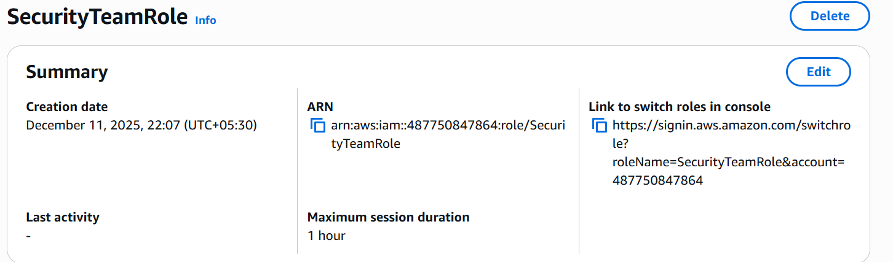
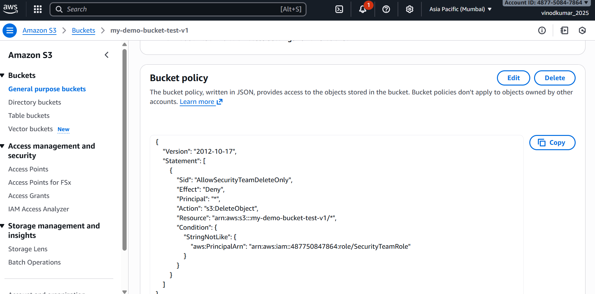
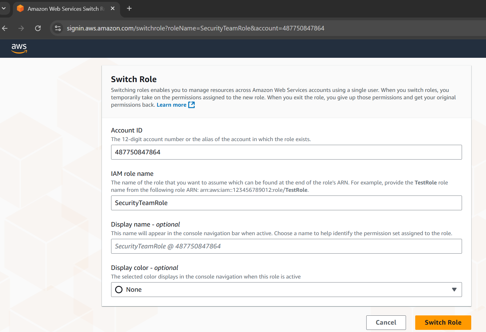
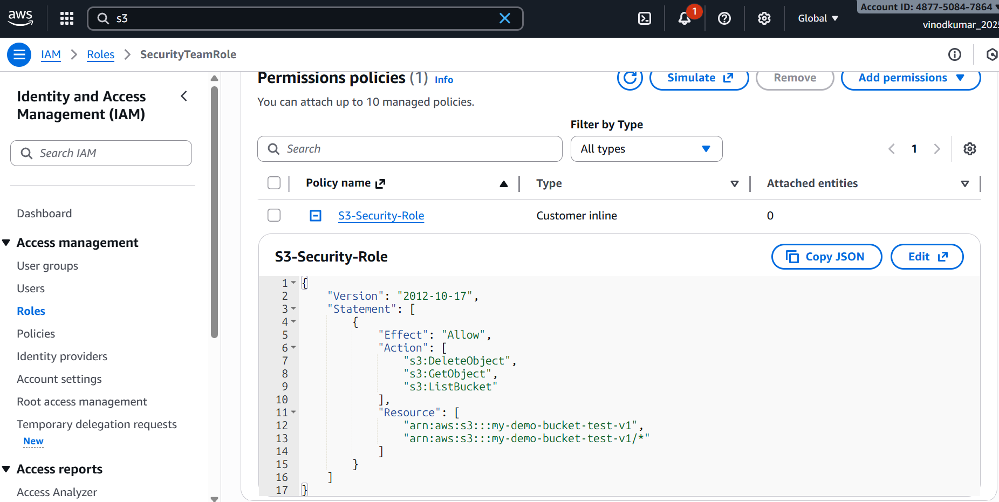
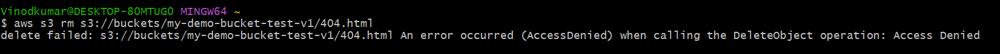
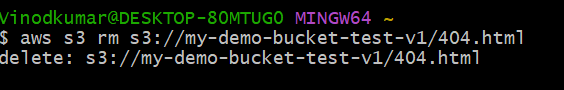

# LAB 5 — Prevent S3 Object Deletion Except for Security Team

## Objective:
Ensure that **only the SecurityTeamRole** can delete S3 objects while all other IAM users, roles, and services are denied deletion.

---

## Step 1 — Create or Identify SecurityTeamRole:
Go to **IAM → Roles → Create role**

- Trusted entity: **AWS Account**
- Use your AWS account ID
- Role name: `SecurityTeamRole`

### Trust Policy (must use your account ID):
```json
{
  "Version": "2012-10-17",
  "Statement": [
    {
      "Effect": "Allow",
      "Principal": {
        "AWS": "arn:aws:iam::<ACCOUNT_ID>:root"
      },
      "Action": "sts:AssumeRole"
    }
  ]
}
```

---

##  Step 2 — Add IAM Policy Allowing Delete to SecurityTeamRole
Go to: IAM → Roles → SecurityTeamRole → Add Inline Policy

```json
{
  "Version": "2012-10-17",
  "Statement": [
    {
      "Effect": "Allow",
      "Action": [
        "s3:DeleteObject",
        "s3:GetObject",
        "s3:ListBucket"
      ],
      "Resource": [
        "arn:aws:s3:::my-demo-bucket-test-v1",
        "arn:aws:s3:::my-demo-bucket-test-v1/*"
      ]
    }
  ]
}
```

This is required so the role has identity-based permissions.

---

## Step 3 — Add Bucket Policy Blocking Deletes for Everyone Except This Role

S3 → Bucket → Permissions → Bucket Policy → Edit

```json
{
  "Version": "2012-10-17",
  "Statement": [
    {
      "Sid": "AllowSecurityTeamDeleteOnly",
      "Effect": "Deny",
      "Principal": "*",
      "Action": "s3:DeleteObject",
      "Resource": "arn:aws:s3:::my-demo-bucket-test-v1/*",
      "Condition": {
        "StringNotLike": {
          "aws:PrincipalArn": "arn:aws:iam::<ACCOUNT_ID>:role/SecurityTeamRole"
        }
      }
    }
  ]
}
```

This ensures:
- **Everyone** is denied delete  
- **Except** the SecurityTeamRole  

---

## Step 4 — Assume the SecurityTeamRole

Run:

```bash
aws sts assume-role   --role-arn arn:aws:iam::<ACCOUNT_ID>:role/SecurityTeamRole   --role-session-name sec-test
```

You will get:
- AccessKeyId  
- SecretAccessKey  
- SessionToken  

Export them:

```bash
export AWS_ACCESS_KEY_ID=XXXX
export AWS_SECRET_ACCESS_KEY=XXXX
export AWS_SESSION_TOKEN=XXXX
```

Verify:

```bash
aws sts get-caller-identity
```

Expected output:

```
"Arn": "arn:aws:sts::<ACCOUNT_ID>:assumed-role/SecurityTeamRole/sec-test"
```

---

## Step 5 — Test Delete Operation

### Run:

```bash
aws s3 rm s3://my-demo-bucket-test-v1/404.html
```

### Expected:
✔ Works for SecurityTeamRole  
❌ Fails for all other users

---

## 🔍 Common Troubleshooting

### ❌ Error: "explicit deny in resource-based policy"
Your bucket policy exception is wrong.  
Verify your role ARN and bucket ARN.

### ❌ Error: "no identity-based policy allows DeleteObject"
You forgot to add `s3:DeleteObject` to SecurityTeamRole IAM policy.

### ❌ Error: "not authorized to perform sts:AssumeRole"
Trust policy is wrong OR user lacks `sts:AssumeRole`.

---
## Screenshots:



















---
## 🎉 Completion
You have successfully implemented an enterprise-grade S3 protection mechanism preventing accidental or malicious object deletion.

This is widely used in:
- Compliance environments  
- Logging systems  
- Financial audit systems  

---

Replace `<ACCOUNT_ID>` with your AWS Account ID before use.
