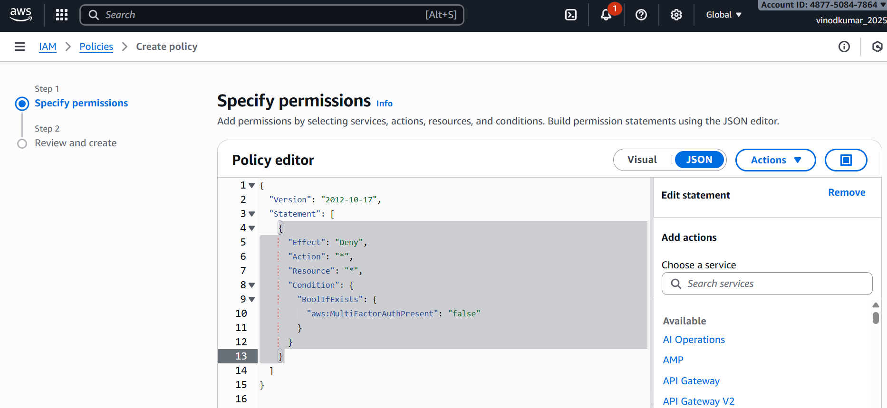
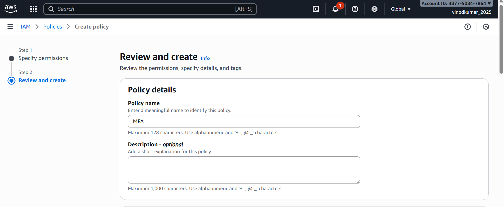
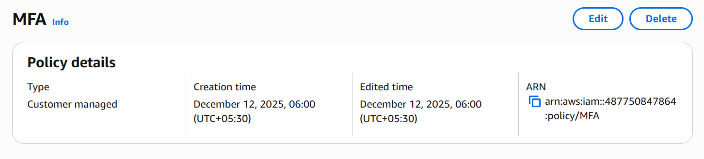
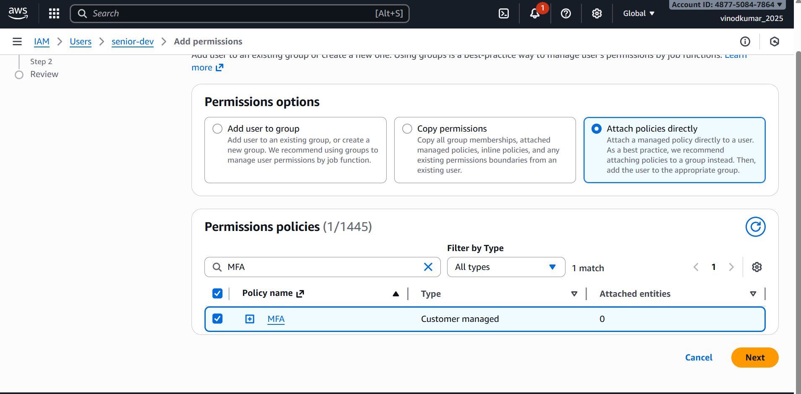
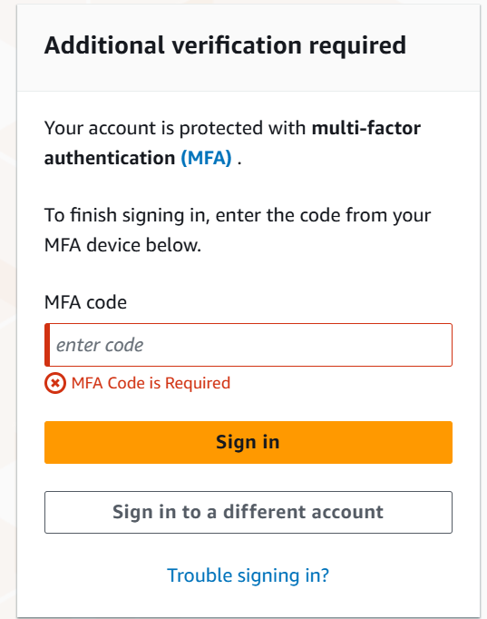
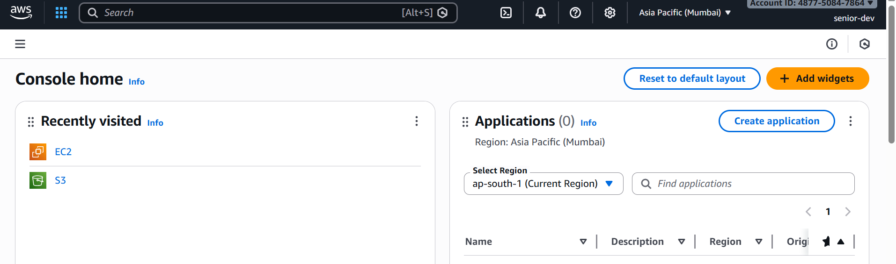

# LAB 6 — Enforce MFA for IAM Users

## Objective:
Enforce MFA for all IAM users so that **no AWS actions** can be performed unless a user is authenticated using Multi-Factor Authentication (MFA).

This lab implements an IAM policy that **denies all actions if MFA is not present**.

---

# STEP 1 — Create MFA Enforcement IAM Policy:

Go to:
**IAM → Policies → Create policy → JSON**

Paste the following:

```json
{
  "Version": "2012-10-17",
  "Statement": [
    {
      "Sid": "DenyIfNoMFA",
      "Effect": "Deny",
      "Action": "*",
      "Resource": "*",
      "Condition": {
        "BoolIfExists": {
          "aws:MultiFactorAuthPresent": "false"
        }
      }
    }
  ]
}
```

Name the policy:
**Enforce-MFA-Policy**

### ✔ What this policy does:
- Denies ALL AWS actions if MFA is not used.
- Allows all actions when MFA is present.
- Works for both console & CLI.

---

# STEP 2 — Attach Policy to Users (or Group):

### Recommended: Attach to a group
1. IAM → Groups → Create group (example: `AllUsers-MFA`)
2. Attach **Enforce-MFA-Policy**
3. Add users to this group

### Alternatively: Attach directly to individual users
IAM → Users → Select user → Permissions → Add permissions → Attach policy

---

# STEP 3 — Configure a Virtual MFA Device:

1. IAM → Users → Select user → **Security credentials** tab
2. Under **Assigned MFA Device** → click **Manage**
3. Choose **Virtual MFA Device**
4. Open Google Authenticator / Authy
5. Scan the QR code
6. Enter two sequential MFA codes
7. Click **Assign MFA**

User now has MFA enabled.

---

# STEP 4 — Test Console Access:

### Test A: Login WITHOUT MFA  
Expected:
❌ User will be denied access to AWS services  
❌ Attempts to view EC2/S3/IAM produce **AccessDenied**

### Test B: Login WITH MFA  
Expected:
✔ Normal access is restored  
✔ User can perform allowed actions

---

# STEP 5 — Test CLI Access (Without and With MFA):

### Test A: CLI without MFA
Run:
```bash
aws s3 ls
```
Expected:
❌ AccessDenied — MFA required

---

# ✔ Correct CLI Method When MFA Is Enabled

Generate session credentials:

```bash
aws sts get-session-token   --serial-number arn:aws:iam::<ACCOUNT_ID>:mfa/<USERNAME>   --token-code <MFA_CODE>
```

Output provides:
- AccessKeyId  
- SecretAccessKey  
- SessionToken  

Export them:

```bash
export AWS_ACCESS_KEY_ID=xxxx
export AWS_SECRET_ACCESS_KEY=xxxx
export AWS_SESSION_TOKEN=xxxx
```

Now test:

```bash
aws sts get-caller-identity
aws s3 ls
```

Expected:
✔ Works successfully with MFA session tokens

---

# Clear AWS Session Credentials:

After testing:
```bash
unset AWS_ACCESS_KEY_ID AWS_SECRET_ACCESS_KEY AWS_SESSION_TOKEN
```

---

# Troubleshooting:

### ❌ "AccessDenied" even with MFA
User may lack `sts:GetSessionToken`. Add this policy:

```json
{
  "Effect": "Allow",
  "Action": "sts:GetSessionToken",
  "Resource": "*"
}
```

### ❌ Console not asking for MFA
Check:
- MFA device is assigned
- User logged out and back in

### ❌ CLI still works without MFA
Check:
- Which credentials are active (`env | grep AWS`)
- If the MFA enforcement policy is attached

---
## Screenshots:


















---
# 🎉 Completion

You have successfully:
- Enforced MFA for IAM users
- Tested console and CLI MFA behavior
- Implemented AWS security best practices
- Prevented non-MFA access using a deny-by-default policy

This approach is used in enterprise environments for strong IAM security.

---

# 📌 Note
Replace `<ACCOUNT_ID>` and `<USERNAME>` with your actual AWS details when running CLI commands.

